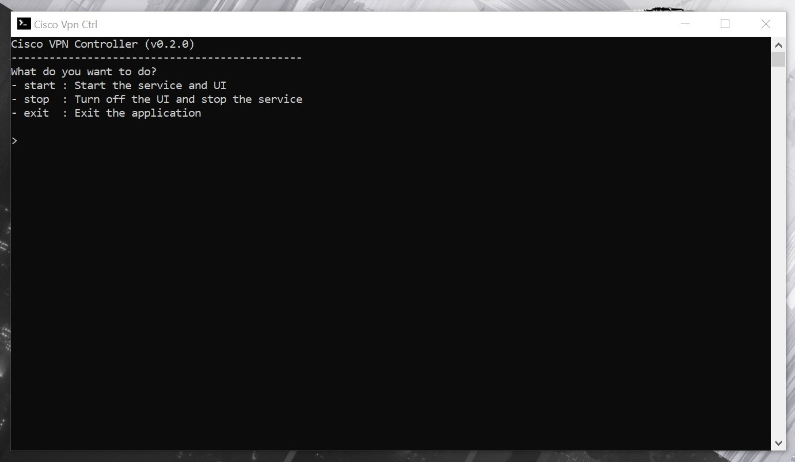

# Cisco VPN Controller

## Opis

Jeżeli korzystasz z aplikacji **Cisco AnyConnect Secure Mobility Client** to jest to aplikacja kóra cię zainteresuje :)

**VPN** od firmy **Cisco** nawet po wyłączeniu działa w tle jako usługa systemowa. Czasami ta usługa potrafi się zawiesić co wymaga jej restartu.

Możesz również mieć potrzebę całkowitego wyłączenia wszystkich składników oprogramowania **Cisco** w celu oszczędzania baterii w laptopie, szybszego uruchamiania się sytemu Windows, itp.

Z pomocą przychodzi ta mała aplikacja która posiada trzy funkcje _(polecenia)_:

- `start`: Uruchamia usługę oraz aplikację do zestawiania połączenia VPN.
- `stop`: Rozłącza z siecią VPN, zamyka aplikację kliencką oraz zatrzymuje usługę.

## Jak używać aplikacji

**(Krok 1)** Klikamy dwa razy w ikonę oraz zatwierdzamy potrzebne uprawnienia administratora.

**(Krok 2)** W terminalu wpisujemy jedno z dostępnych poleceń i naciskamy klawisz [ENTER]

## Autor

Adrian Gargula | adrgar@interia.pl